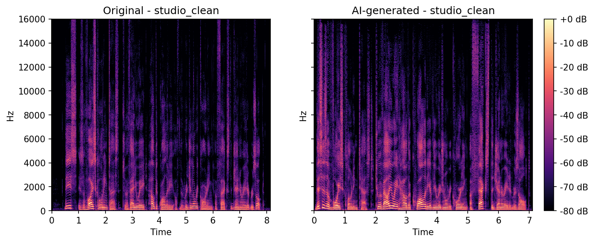
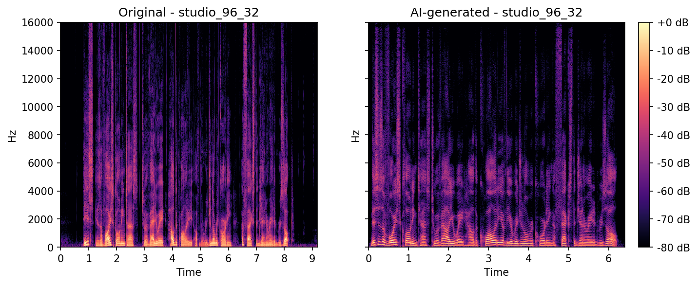
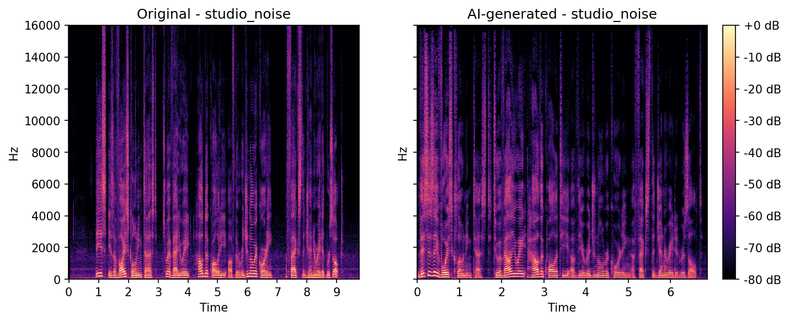
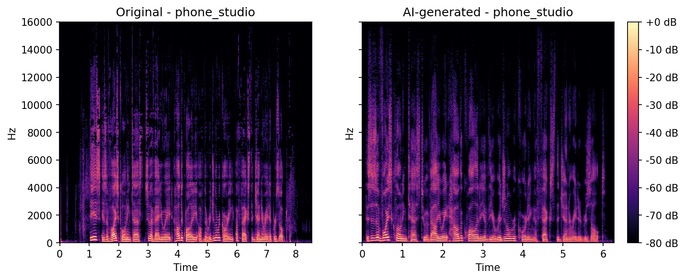
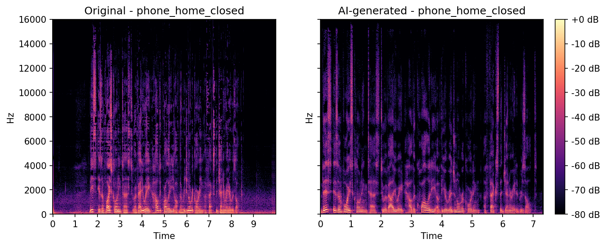
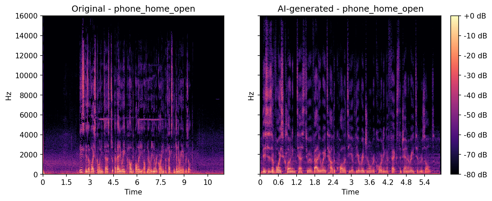
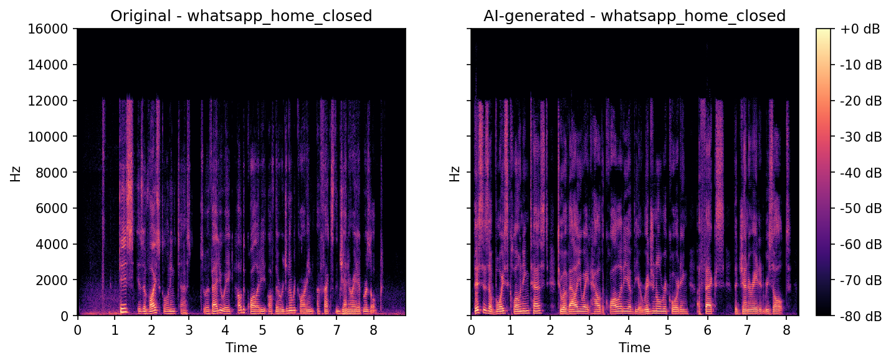

# Voice cloning quality test: how the capture chain affects the result

## Hypothesis
The technical quality of the input recording (background noise, capture chain,
processing) directly affects the fidelity of the voice clone generated by ElevenLabs.

## Methodology
I recorded the same input text in 7 different capture conditions, ranging from
everyday use (phone at home) to an acoustically treated studio with technical control:

**Phase 1, home, phone:**
- **phone_home_open**: phone, living room at home, window open (external noise present)
- **phone_home_closed**: phone, living room at home, window closed
- **whatsapp_home_closed**: same closed room, but sent as a WhatsApp voice message
  (the app's own compression and processing)

**Phase 2, studio:**
- **phone_studio**: phone, inside the studio (isolates the device effect while keeping
  the environment controlled)
- **studio_clean**: studio microphone, clean reference, no leakage
- **studio_noise**: studio microphone, with controlled background noise (vacuum cleaner
  or hiss running)
- **studio_96_32**: studio microphone, 96kHz/32bit, compared against the clean reference
  to test whether a spec above the minimum recommended by ElevenLabs (22kHz) changes
  anything perceptible

Each recording was sent to the ElevenLabs API (Instant Voice Cloning) to create a
separate clone. Then I asked the API to generate the same test sentence using each
clone, isolating the capture variable as the only factor that differs between them.

**Note on upload format:** by default, every file is converted to MP3 320kbps before
upload, following ElevenLabs' official recommendation (their docs state that WAV does
not improve clone quality and can cause upload problems). Exception: `studio_96_32` was
sent without MP3 conversion, deliberately, to compare my standard studio delivery
(`studio_clean`, MP3, normal use) against an elevated-spec capture. The native file
(WAV 96kHz/32bit stereo, 52MB) was rejected on upload: the ElevenLabs API limits files
to 11MB. I then sent lossless FLAC 96kHz mono 16-bit, which preserves the core point of
the condition — a sample rate well above the 22kHz minimum ElevenLabs recommends —
without lossy compression. The rejection of the larger file is itself a data point:
their pipeline is designed for compressed delivery. This pair therefore tests the
difference between "standard delivery" and "elevated-spec capture" as a package, with
format and spec changing together, not an isolated test of pure sample rate/bit depth.
The original master stays in `raw/` (outside version control).

**Known limitation:** since `studio_clean` also serves as the reference in the
environment and noise comparisons (`phone_studio`, `studio_noise`, which also go
through the MP3 conversion), those specific comparisons keep the format consistent
between them, without that extra variable.

## Results

For each condition: spectrogram of the reference (original recording of the short
sentence) on the left, audio generated by the API from that condition's clone on the
right. All on the same scale: magma colormap, −80 to 0 dB window normalized to the
peak, 0 to 16 kHz range (the API output ceiling).

**`studio_clean`** — studio microphone → interface → DAW, exported as MP3 320 kbps.
A purely linear capture chain: preamp gain and A/D conversion, nothing else. No noise
reduction, AGC or dynamic high-frequency enhancement enters the signal. The result is a
low, **static** noise floor that does not track the voice. In the generated audio this
translates into genuinely dark silences between phonemes, stable harmonic structure,
and the sharpest consonant transients of the set. This is the reference for the test.

**`studio_96_32`** — same capture chain, file in FLAC 96 kHz. Spectrogram is nearly
identical to `studio_clean`; the difference is only in fine detail in the 5–12 kHz band.
On listening, slightly better consistency, but the difference is marginal and at the
limit of what a single generation can establish — separating a spec effect from the
TTS's own variance would require several generations per condition.

**`studio_noise`** — studio microphone → interface, with controlled room noise during
capture. The stationary noise bed appears in the original, but because the voice was
captured strong and unprocessed, the generated audio preserves well-defined harmonics
and a clean formant region, landing visibly closer to `studio_clean` than to any phone
capture. The model can separate a stable broadband noise from a well-formed voice
signal.

**`phone_studio`** — iPhone inside the same treated studio. The environment is the same
as `studio_clean`, but the signal chain is not: the device's MEMS capsule necessarily
passes through an internal DSP chain (noise suppression, AGC, high-frequency
enhancement) that is **voice-adaptive** — it clamps down in the silences and opens up
on speech. In the generated audio the gaps between phonemes are noisier than in
`studio_clean` and the 5–10 kHz band takes on an unstable texture. Same room, worse
result: the difference is the device's processing.

**`phone_home_closed`** — iPhone, living room at home, window closed. Adds the device
DSP to an untreated environment. Continuous noise floor below ~2.5 kHz and little real
silence between words in the generated audio. Usable clone, but with an audible "bed" of
noise that the model folded into the timbre.

**`phone_home_open`** — iPhone, living room at home, window open. Worst environment
case: the original has dense broadband street noise and a tonal component around 5 kHz.
The phone's DSP, trying to deal with that noise, modulates it along with the voice. The
generated audio has almost no true silence — the external noise has become part of the
clone's timbre.

**`whatsapp_home_closed`** — same closed room, sent as a WhatsApp voice message. On top
of the device DSP, the app's voice codec imposes an abrupt cutoff at ~12 kHz and adds
coding noise. Both enter the clone: a 12 kHz band ceiling in the generated audio and
diffuse energy between phonemes. Compression degrades beyond what the environment
already degraded.

## Conclusion

Recommendations for anyone about to send audio for cloning on ElevenLabs, in the order
of impact observed in this test:

**1. The signal chain matters as much as the environment.** A microphone into an audio
interface makes a linear, transparent capture: preamp and A/D conversion, nothing more.
The resulting noise floor is low and static — it does not "pump" with the voice. A phone
does the opposite: the capsule feeds a mandatory DSP chain (noise suppression, AGC,
high-frequency enhancement, sometimes single-channel de-reverb) that is voice-adaptive,
clamping down in the silences and opening up on speech. The cloning model cannot tell
that processing apart from the person's real timbre and folds it into the clone. In the
spectrograms, the interface captures produce clones with dark, clean gaps between words
and stable harmonics; the phone captures produce clones with a permanent modulated noise
bed and an unstable timbre.

**2. A dedicated microphone beats a mobile device even with acoustic leakage in the
room.** `studio_noise` (microphone + vacuum cleaner running) produced a better clone
than `phone_home_open` (iPhone + open window). A voice captured strong and unprocessed,
even with background noise, gives the model more clean material than a weak, already
processed voice.

**3. Never send audio that has passed through a messaging app or a low-bitrate voice
codec.** `whatsapp_home_closed` was the most degraded result of the test — the codec's
band limitation and coding noise enter the clone and do not come out.

**4. The type of noise matters more than the level.** Stationary noise that is
spectrally distinct from the voice (air conditioning, hiss) is tolerable if the voice is
well captured. Modulated noise correlated with the voice — a phone's processing, a busy
street — is much worse, because the model cannot separate it from the signal.

**5. A spec above the recommendation (96 kHz / 24 bit+) brings only marginal gain.**
Do not prioritize it over microphone, room treatment and absence of compression. The API
output is limited to ~16 kHz anyway.

**Ideal delivery:** a quality microphone into an audio interface, the driest possible
signal, no processing whatsoever, WAV or FLAC, no messaging app. If size must be reduced
(the API rejects files above 11 MB), MP3 320 kbps or FLAC — never a low-bitrate voice
format.

## How to run this project
See INSTRUCTIONS.md
